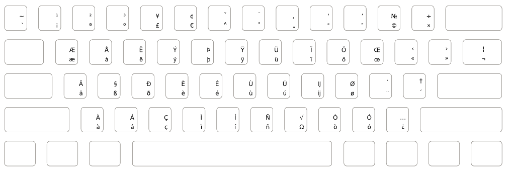
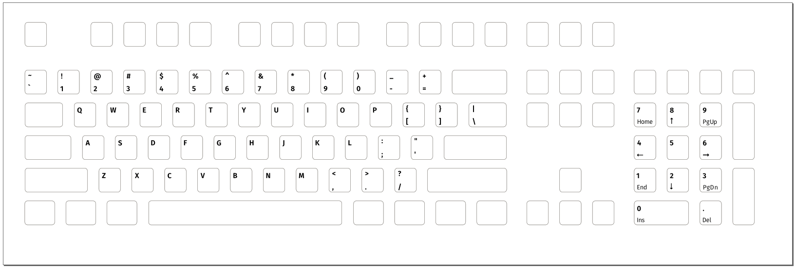
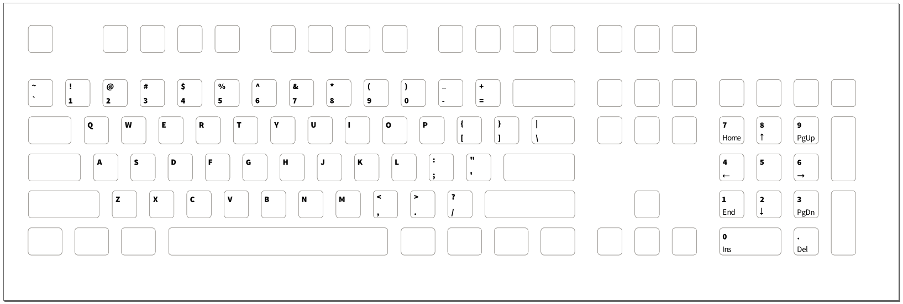
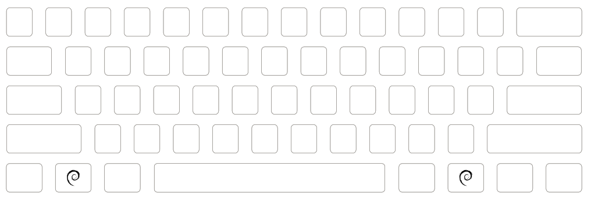

wasdkeyboards
=============

Keyboard layout files for printing your own custom mechanical keyboard at [WASD Keyboards][1].

Have you ever wanted your own, high quality mechanical keyboard with your very own
keboard layout? You can have one printed at [WASD Keyboards][1],
the company that also makes the excellent [CODE keybard][2].

**If you have an interesting layout to add:**

 0. Use Inkscape, not any other editor.
 1. Add your layout to the existing SVG file as a layer.
 2. Keep your font information etc. intact **do not convert to paths** yet.
 3. Make a note of the required fonts in this README.

**If you want to have a keyboard made using one of these layouts**

 0. Use Inkscape, not any other editor.
 1. Convert the layers you want printed into paths on your machine, so you
 know that your file will work even without having the fonts you used.
 This is very important. If you don't do this, you risk that your
 keyboard will turn out looking like crap and not at all as you've designed
 it.
 2. Hide or delete all the layers that you don't want.
 3. Upload the SVG file when ordering your keyboard from [WASD Keyboards][1].
 You can upload custom layout files before you add the keyboard to your cart.
 This is also where you can use the V2 designer to color individual keys.
 **Do not** color keys in the layout file itself.
 4. Wait while they print and assemble your keyboard, then bask in the pure and
 simple joy of using an excellent typing tool.

## Featured layouts and symbols

### EurKEY additions

This layer adds the extra symbols present on the [EurKEY keyboard layout][3],
a layout that allows you to write all the European languages **and** develop
software without switching layouts.

Fonts used:

 * Sans (as installed in Debian GNU/Linux)

### Fira Sans alpha keys

An alpha layout using Mozilla's Fira Sans font.

Fonts used:
  * Fira Sans semibold
  * Fira Sans regular

### Source Sans Pro alpha keys

An alpha layout using Adobe's Source Sans Pro font.

Fonts used:
  * Source Sans Pro heavy
  * Source Sans Pro regular

### Debian OS keys

OS keys using the swirl logo of the Debian project.

## License

This work is licensed under the Creative Commons Attribution-ShareAlike 4.0
International License. To view a copy of this license, visit
http://creativecommons.org/licenses/by-sa/4.0/ or send a letter to Creative
Commons, PO Box 1866, Mountain View, CA 94042, USA.

This relicensing was authorized in writing by Weyman Kwong of
[WASD Keyboards](http://www.wasdkeyboards.com) on November 10, 2014.

See the file CREDITS for individual copyrights.

[1]: http://www.wasdkeyboards.com
[2]: http://www.wasdkeyboards.com/index.php/products/code-keyboard.html
[3]: http://eurkey.steffen.bruentjen.eu
